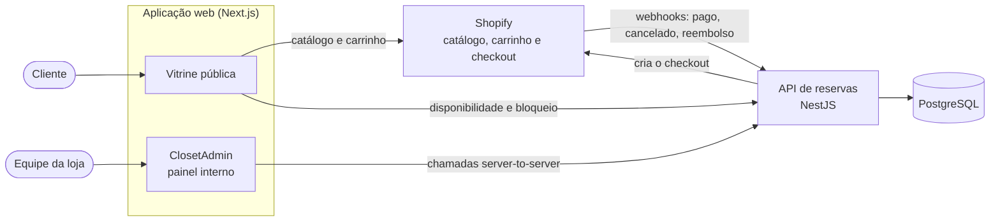

<div align="center">

# VS BY CLOSET

**Aluguel de roupas para viagens ao Chile.**
Escolha as peças online, reserve as datas da sua viagem e retire e devolva tudo numa loja física no Chile.


</div>

---

## Sumário

- [Sobre o projeto](#sobre-o-projeto)
- [Como funciona](#como-funciona)
- [Funcionalidades](#funcionalidades)
- [Arquitetura](#arquitetura)
- [Stack tecnológica](#stack-tecnológica)
- [Estrutura do repositório](#estrutura-do-repositório)
- [Instalação local](#instalação-local)
- [Segurança e boas práticas](#segurança-e-boas-práticas)
- [Status do projeto](#status-do-projeto)
- [Licença e uso](#licença-e-uso)

---

## Sobre o projeto

A **VS BY CLOSET** é uma plataforma de aluguel de roupas pensada para quem viaja ao Chile e prefere chegar com um closet pronto, sem carregar bagagem extra. O cliente escolhe as peças e as datas pelo site, paga pelo checkout seguro e faz a retirada e a devolução presencialmente numa loja física no Chile.

O projeto reúne duas frentes num único repositório:

- **Vitrine pública**, com catálogo, calendário de disponibilidade em tempo real, carrinho e reserva.
- **ClosetAdmin**, um painel interno para a equipe da loja operar reservas, peças, regras de aluguel, relatórios e permissões.

A principal garantia do sistema é simples: **a mesma peça física nunca é reservada duas vezes para o mesmo período**. Essa regra é aplicada pelo próprio banco de dados, e não apenas pela interface.

---

## Como funciona

1. **Escolha as peças.** O cliente navega pelo catálogo, filtra por categoria e abre a página de cada peça.
2. **Selecione o período.** O calendário mostra apenas as datas realmente livres. A data de devolução é calculada automaticamente pelas regras de aluguel.
3. **Reserve.** Ao seguir para a reserva, as peças ficam bloqueadas por um tempo curto, o suficiente para o cliente concluir o pagamento sem que outra pessoa reserve a mesma peça.
4. **Pague no checkout.** O pagamento acontece no checkout nativo da Shopify.
5. **Confirmação automática.** Quando a Shopify avisa que o pedido foi pago, a reserva é confirmada. Cancelamentos e reembolsos liberam as peças de volta para o calendário.
6. **Retire e devolva na loja.** A equipe acompanha tudo pelo ClosetAdmin.

---

## Funcionalidades

### Para o cliente

| Funcionalidade | O que oferece |
| --- | --- |
| **Catálogo de peças** | Listagem com filtro por categoria e cards responsivos. |
| **Página de produto** | Galeria com miniaturas e ampliação, descrição e preço. |
| **Calendário de disponibilidade** | Datas livres e ocupadas em tempo real, com devolução calculada pelas regras de aluguel. |
| **Reserva online** | Bloqueio temporário das peças enquanto o pagamento é concluído. |
| **Carrinho** | Gaveta lateral e página própria, com conferência da disponibilidade física para a data escolhida. |
| **Checkout** | Pagamento processado pelo checkout nativo da Shopify. |
| **Valle Pass** | Vale-presente e crédito de compra, vendido como produto separado, que não passa pelo fluxo de aluguel. |

### Para a equipe (ClosetAdmin)

| Funcionalidade | O que oferece |
| --- | --- |
| **Dashboard operacional** | Visão dos próximos dias: retiradas, devoluções, peças ocupadas e alertas. |
| **Controle de reservas** | Busca e filtros, detalhe da reserva, criação manual pela equipe, cancelamento e arquivamento de histórico com possibilidade de restaurar. |
| **Calendário operacional** | Agenda semanal com preparação, retirada, aluguel, devolução e limpeza. |
| **Peças físicas** | Cadastro das unidades, ativação e desativação, disponibilidade online e vínculo com os produtos da loja. |
| **Regras e bloqueios** | Antecedência mínima, preparação, limpeza, limite de peças, temporada bloqueada, duração por quantidade de peças e bloqueios operacionais. |
| **Auditoria operacional** | Registro das ações importantes: quem fez, o quê e quando. |
| **Relatórios em PDF** | Reserva individual, relatório por período e relatório operacional. |
| **Funcionários e permissões** | Login individual, papéis (proprietário, administrador e equipe) e acesso por módulo. |
| **Valle Pass** | Campanhas, consulta e validação de vouchers, marcação de uso e cancelamento. |

Também estão disponíveis, de forma opcional, um **lembrete automático de retirada** (desligado por padrão até ser configurado) e o modo claro e escuro no painel.

---

## Arquitetura



**Quem é a fonte de verdade de cada coisa:**

| Responsabilidade | Onde vive |
| --- | --- |
| Produtos, preços, fotos e descrições | Shopify |
| Carrinho, checkout, pagamento e pedido | Shopify |
| Disponibilidade por período, regras de aluguel e bloqueio temporário | API de reservas + PostgreSQL |
| Reservas manuais, calendário operacional, auditoria e permissões | ClosetAdmin + API de reservas |

O ClosetAdmin é um apoio operacional: ele **não recria** produto, preço, pedido ou pagamento da Shopify e não funciona como um sistema financeiro paralelo.

---

## Stack tecnológica

| Camada | Tecnologias |
| --- | --- |
| **Frontend** | Next.js (App Router), React, TypeScript, Tailwind CSS, GSAP, Framer Motion, Three.js |
| **API** | NestJS, TypeScript, Prisma, class-validator, Helmet, rate limiting, PDFKit |
| **Banco de dados** | PostgreSQL |
| **Integração** | Shopify (Storefront API, webhooks e app da Shopify) |
| **Qualidade** | Vitest, teste de fluxo de checkout com `node:test`, ESLint, GitHub Actions |
| **Monorepo** | pnpm workspaces |
| **Hospedagem** | Nuvem: frontend na Vercel e API na Railway, com PostgreSQL gerenciado |

---

## Estrutura do repositório

```text
.
├── apps/
│   ├── marketing/          # Next.js: vitrine pública e ClosetAdmin (/closetadmin)
│   ├── reservations-api/   # NestJS + Prisma: reservas, regras, webhooks, PDFs
│   ├── shopify-app/        # App da Shopify que registra os webhooks
│   └── web/                # Legado, sem uso
├── theme/                  # Legado, sem uso
├── docs/                   # Documentação técnica
├── scripts/                # Testes e utilitários de apoio
└── .github/workflows/      # Integração contínua
```

---

## Instalação local

### Pré-requisitos

- Node.js 20 ou superior
- pnpm
- Uma instância de PostgreSQL acessível (use um banco de desenvolvimento, nunca o de produção)
- Uma loja Shopify de desenvolvimento com acesso à Storefront API

### Passo a passo

**1. Clone o projeto e instale as dependências**

```bash
git clone https://github.com/<sua-organizacao>/<seu-repositorio>.git
cd <seu-repositorio>
pnpm install
```

**2. Configure as variáveis de ambiente**

Cada aplicação tem o seu `.env.example`. Copie-os e preencha com valores do seu ambiente:

```bash
cp apps/reservations-api/.env.example apps/reservations-api/.env
cp apps/marketing/.env.example apps/marketing/.env.local
```

Exemplo do que deve ser preenchido na **API** (`apps/reservations-api/.env`):

```env
DATABASE_URL=sua_connection_string
PORT=3333
CORS_ALLOWED_ORIGINS=http://localhost:3000

SHOPIFY_STORE_DOMAIN=sua-loja.myshopify.com
SHOPIFY_STORE_CURRENCY=BRL
SHOPIFY_STOREFRONT_TOKEN=seu_token_aqui
SHOPIFY_CLIENT_SECRET=seu_segredo_aqui

RESERVATION_BINDING_SECRET=gere_um_valor_aleatorio_longo
ADMIN_API_TOKEN=gere_um_valor_aleatorio_longo
```

Exemplo do que deve ser preenchido no **frontend** (`apps/marketing/.env.local`):

```env
NEXT_PUBLIC_SHOPIFY_STORE_DOMAIN=sua-loja.myshopify.com
NEXT_PUBLIC_SHOPIFY_STOREFRONT_TOKEN=seu_token_aqui
NEXT_PUBLIC_SHOPIFY_STORE_URL=https://sua-loja.myshopify.com
NEXT_PUBLIC_SITE_URL=http://localhost:3000

NEXT_PUBLIC_AVAILABILITY_URL=http://localhost:3333/availability
NEXT_PUBLIC_RENTAL_PLAN_URL=http://localhost:3333/rental-plan/duration
NEXT_PUBLIC_HOLDS_URL=http://localhost:3333/holds
NEXT_PUBLIC_CHECKOUT_URL=http://localhost:3333/checkout
NEXT_PUBLIC_RESERVATIONS_URL=http://localhost:3333/reservations

RESERVATIONS_API_ADMIN_URL=http://localhost:3333
ADMIN_API_TOKEN=o_mesmo_valor_definido_na_api
```

> `ADMIN_API_TOKEN` precisa ter **exatamente o mesmo valor** na API e no frontend. Os valores de `RESERVATION_BINDING_SECRET` e `ADMIN_API_TOKEN` devem ser gerados por você (por exemplo, com `openssl rand -hex 32`) e nunca reaproveitados entre segredos diferentes.

**3. Prepare o banco de dados**

```bash
pnpm --filter @valle/reservations-api db:generate
pnpm --filter @valle/reservations-api db:migrate:dev
```

**4. Crie o primeiro usuário do painel**

O script lê os dados de variáveis de ambiente, para que nada fique gravado no código. O PIN é armazenado apenas como hash.

```bash
ADMIN_SEED_NAME="Seu Nome" ADMIN_SEED_PHONE="+00 00000 0000" ADMIN_SEED_PIN="seu_pin" ADMIN_SEED_ROLE="SUPER_ADMIN" \
  pnpm --filter @valle/reservations-api exec tsx scripts/seed-admin.ts
```

**5. Inicie a API e o frontend** (em dois terminais)

```bash
pnpm --filter @valle/reservations-api dev
```

```bash
pnpm --filter @valle/marketing dev
```

Com tudo no ar:

- Vitrine: `http://localhost:3000`
- Painel da equipe: `http://localhost:3000/closetadmin/login`
- API: `http://localhost:3333`

### Qualidade e testes

```bash
pnpm lint                                              # lint de todos os pacotes
pnpm build                                             # build do frontend
node --test scripts/checkout-flow.test.mjs             # guardas do fluxo de checkout
pnpm --filter @valle/reservations-api test             # testes da API
```

> Os testes da API são de integração e **escrevem no banco configurado em `DATABASE_URL`**. Rode-os sempre contra um banco isolado, criado só para testes.

---

## Segurança e boas práticas

- **Segredos fora do código.** Tokens, chaves e connection strings vivem apenas em variáveis de ambiente. Os arquivos `.env` são ignorados pelo Git e os `.env.example` trazem somente placeholders.
- **Sem credenciais no navegador.** O painel fala com a API de servidor para servidor. O token de serviço nunca chega ao cliente, e variáveis `NEXT_PUBLIC_` nunca devem receber tokens de administração.
- **Autenticação da equipe.** Login individual com PIN armazenado como hash, sessão em cookie `HttpOnly`, tokens de sessão guardados apenas como hash, expiração, revogação e limite de tentativas. Respostas de erro não revelam se um usuário existe.
- **Autorização no backend.** Papéis e permissões por módulo são validados na API em toda ação protegida, e não apenas escondidos na interface.
- **Webhooks confiáveis.** Os eventos da Shopify têm a assinatura verificada e são processados de forma idempotente, então uma entrega repetida não duplica nada.
- **Consistência garantida pelo banco.** Uma restrição no PostgreSQL impede a reserva dupla da mesma peça, mesmo sob concorrência.
- **Entrada validada.** Os dados recebidos pela API passam por validação estrita, que descarta campos não declarados. A API usa cabeçalhos de segurança, CORS restrito às origens permitidas e limitação de taxa.
- **Auditoria sem dados sensíveis.** O registro de ações nunca guarda PINs, tokens ou segredos.
- **Testes em ambiente isolado.** Testes que escrevem dados nunca devem apontar para um banco real. A integração contínua roda typecheck, lint, testes e build a cada alteração.

Se você encontrar uma vulnerabilidade, **não abra uma issue pública** com os detalhes: entre em contato com a equipe responsável pelo projeto por um canal privado.

---

## Status do projeto

O projeto está **ativo e em evolução contínua**. O fluxo completo já está implementado: catálogo, calendário de disponibilidade, reserva com bloqueio temporário, carrinho, checkout, confirmação por webhooks, Valle Pass e o painel administrativo com reservas, peças, regras, auditoria, relatórios em PDF e permissões.

Funcionalidades opcionais, como o lembrete automático de retirada, ficam desligadas até que sejam configuradas. As pastas `apps/web` e `theme` são legado e não recebem mais desenvolvimento.

---

## Licença e uso

Este é um projeto **proprietário e de uso privado**. Todos os direitos reservados. Não é permitido copiar, modificar, distribuir ou utilizar o código, total ou parcialmente, sem autorização prévia por escrito dos responsáveis.
